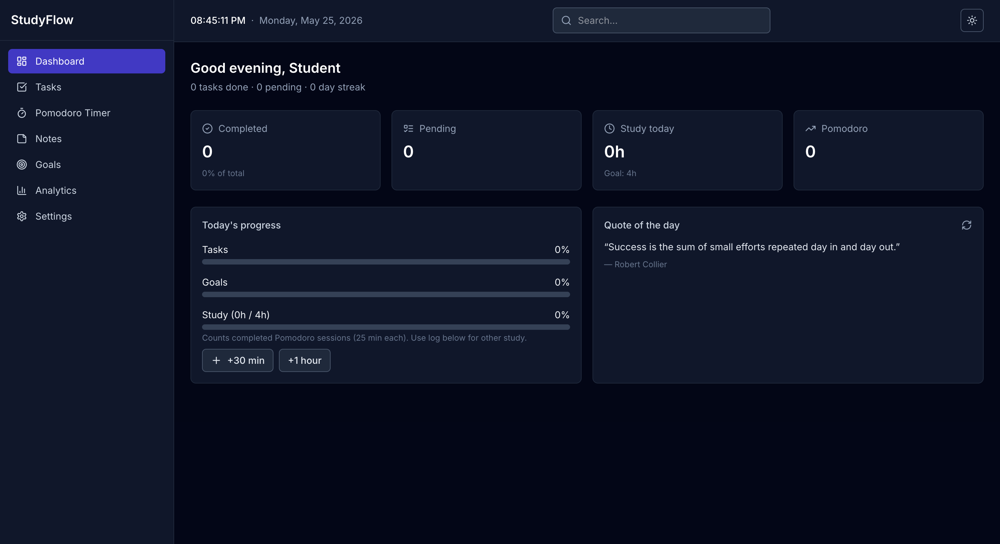
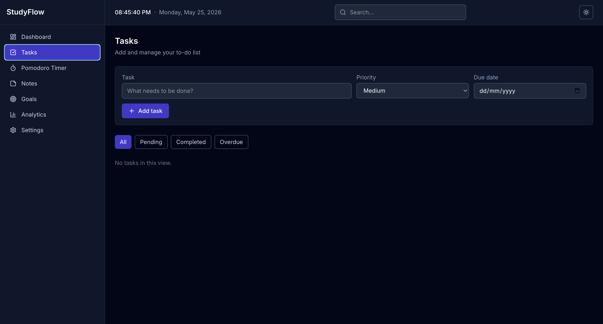
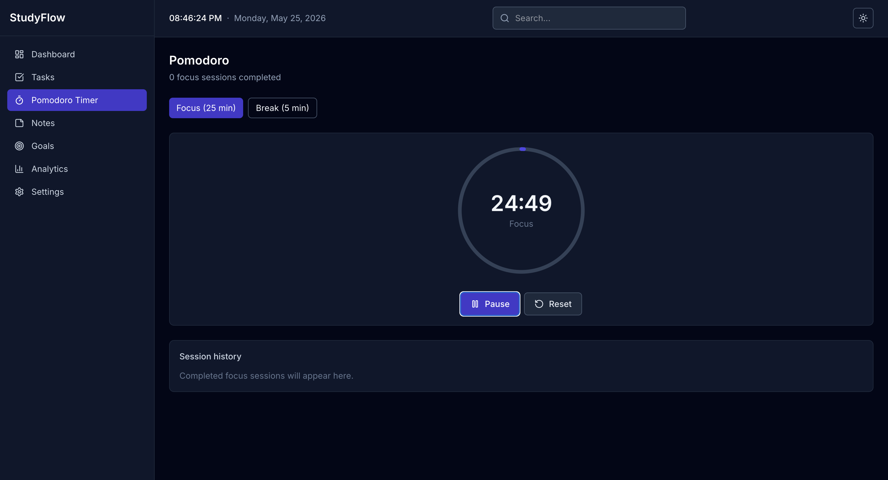
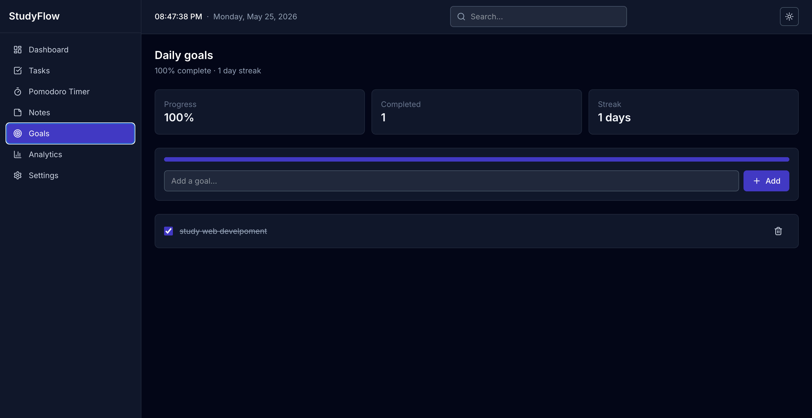

# StudyFlow 📚

### Student Productivity Dashboard

StudyFlow is a modern student productivity dashboard built to help students manage their daily workflow in one place.  
The application combines task management, note-taking, Pomodoro sessions, analytics, and goal tracking with a clean and responsive interface.

Built using React, Vite, and Tailwind CSS, the project focuses on delivering a smooth user experience with a modern SaaS-inspired UI design.

---

## 🚀 Live Demo

🔗 (https://studyflowco.netlify.app/)

---

## 📸 Screenshots

### Dashboard

<p align="center">
  
</p>

### Tasks Section

<p align="center">
  
</p>

### Pomodoro Timer

<p align="center">
  
</p>

### Goals

<p align="center">
  
</p>

---

## ✨ Features

### 📊 Dashboard
- Productivity overview
- Daily statistics and summaries
- Motivation quotes with API fallback
- Live clock and quick insights

### ✅ Task Management
- Create, edit, and delete tasks
- Task priorities and filters
- Search functionality
- LocalStorage persistence

### ⏳ Pomodoro Timer
- 25/5 minute focus sessions
- Circular progress indicator
- Session tracking
- Sound alerts

### 📝 Notes
- Create and manage notes
- Auto-save functionality
- Quick editing experience

### 🎯 Goals & Progress
- Daily goals tracking
- Progress bars
- Productivity streak counter

### 📈 Analytics
- Pie charts
- Bar charts
- Line charts
- Productivity insights using Recharts

### ⚙️ Settings
- Theme customization
- Profile settings
- Notification preferences

### 🎨 UI & Experience
- Fully responsive design
- Dark mode support
- Glassmorphism UI
- Smooth animations and transitions
- Toast notifications

---

## 🛠️ Tech Stack

### Frontend
- React 19
- Vite
- Tailwind CSS v4

### Libraries & Tools
- Recharts
- react-hot-toast
- lucide-react

### State & Storage
- React Hooks
- Context API
- LocalStorage

---

## 📂 Project Structure

```bash
src/
├── components/
│   ├── analytics/
│   ├── dashboard/
│   ├── goals/
│   ├── layout/
│   ├── notes/
│   ├── pomodoro/
│   ├── settings/
│   ├── tasks/
│   └── ui/
│
├── context/
├── hooks/
└── utils/
```

---

## ⚡ Getting Started

### 1. Clone the Repository

```bash
git clone https://github.com/your-username/studyflow.git
```

### 2. Navigate to Project Folder

```bash
cd studyflow
```

### 3. Install Dependencies

```bash
npm install
```

### 4. Start Development Server

```bash
npm run dev
```

Open:

```bash
http://localhost:5173
```

---

## 📦 Build for Production

```bash
npm run build
npm run preview
```

---

## 🎨 Design Highlights

- Modern SaaS-inspired interface
- Clean typography and spacing
- Responsive layouts for all devices
- Smooth user interactions
- Minimal and distraction-free design

---

## 💡 Future Improvements

- Authentication system
- Cloud sync support
- Calendar integration
- Team collaboration features
- AI-powered productivity suggestions
- Backend database integration

---

## 🙌 Author

Developed by Navin Bohara

---

## 📄 License

This project is licensed under the MIT License.

---

## ⭐ Support

If you found this project useful, consider giving it a ⭐ on GitHub.
